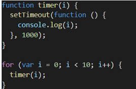

Dear candidate,

Thanks for your interest on the role. Your performance on the interviews so far was impressive! We would like to move forward to the next step in which we would like to see your technical skills a little bit more detailed. That is an offline task with two parts. You can use any technology you want. When you finish, please share the repository link with us so that we can check your codes. Note that in each task you will need to deliver a working code. Once we receive your code we will evaluate internally and reach out to you for an on-site (or online) meeting to discuss about your code, and how you approached the tasks.

1. In publishing industry every book has an internationalized number which uniquely defines itself. It is called the ISBN number. There are multiple versions of ISBN number formatting and validation. In this example we will use only 13 digit ISBNs. In the repository you will find an input json that defines a set of books isbn, titles and appendix page numbers. Also, static cover images for the related books. There are sketches which were created by UX team to shape your task that you can see in [Figma](https://www.figma.com/file/PBayyt1zClI5M60MhIieu1/Test-for-Frontend-Dev?node-id=0-1). The following tasks should be fulfilled: 
- Write an ISBN validator function, that resolves if the ISBN given is valid or not. For example: for an Input "9780300267662", the Output should be the boolean "true". For an Input "978030026766**3**", the Output should be the boolean "false". For 13 digit ISBN remainder calculation you can refer to [ISBN Information](https://isbn-information.com/check-digit-for-the-13-digit-isbn.html).
- Write a Roman numeral converter function, that converts integer numbers into Roman numerals. For example: for an Input "34", the Output should be "XXXIV". 
- Create a web page aligned with the UX design that we provided, whose display a list with the ISBNs available in the file *books.json*.
- Each ISBN item in the list is clickable and should display the cover image whose file name matches with the respective ISBN, as well the book information (ISBN, title and the converted roman numeral of the appendix page numbers). If the ISBN isn’t valid, display the default image and an error message.

Please remember to use the page designs that we provided, and feel free to implement any other functionality that you deem important.

2. What is the output of the code in the image below? Why setTimeout isn’t working? Change the code to print each value after the specified setTimeout interval (e.g. 1000ms).

